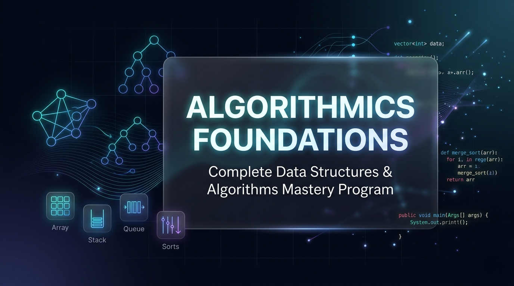

<div align="center">

# 🎯 Algorithmics Foundations
### *Complete Data Structures and Algorithms Mastery Program*



[](https://github.com/AbhishekGiri04/Algorithmics-Foundations)
[](https://github.com/AbhishekGiri04/Algorithmics-Foundations)
[](https://github.com/AbhishekGiri04/Algorithmics-Foundations)
[](https://github.com/AbhishekGiri04/Algorithmics-Foundations)
[](https://github.com/AbhishekGiri04/Algorithmics-Foundations)
[](https://opensource.org/licenses/MIT)

</div>

---

## 🚀 About This Project

**Algorithmics Foundations** is a comprehensive **Data Structures and Algorithms** learning repository designed for computer science students, software engineers, and coding interview preparation. This project provides a complete roadmap to master fundamental and advanced DSA concepts through systematic learning and practical implementation.

### 🎯 What You'll Master

#### 📊 **Data Structures**
- **Linear**: Arrays, Strings, Linked Lists, Stacks, Queues
- **Non-Linear**: Trees, Binary Trees, BST, AVL, Graphs
- **Advanced**: Heaps, Hash Tables, Tries, Disjoint Sets
- **Specialized**: Segment Trees, Fenwick Trees, B-Trees

#### ⚡ **Algorithms**
- **Sorting**: Bubble, Selection, Insertion, Merge, Quick, Heap Sort
- **Searching**: Linear, Binary, Ternary, Exponential Search
- **Graph**: BFS, DFS, Dijkstra, Floyd-Warshall, Kruskal, Prim
- **Dynamic Programming**: Memoization, Tabulation, Optimization
- **Advanced**: Backtracking, Divide & Conquer, Greedy, Branch & Bound

### 🎯 Key Features

- **📚 36 Comprehensive Guides**: Complete coverage from fundamentals to advanced topics
- **💻 Multi-Language Implementation**: C++, Python, and Java solutions with detailed explanations
- **🧠 18 LeetCode Problems**: Real interview questions with step-by-step solutions
- **📊 Complexity Analysis**: Time and space complexity analysis for every solution
- **🔄 Structured Learning Path**: Progressive difficulty from beginner to expert level
- **📖 Interview Ready**: Optimized for coding interviews and competitive programming

---

## 📁 Complete Repository Structure

```
Algorithmics-Foundations/
├── 🖼️ assets/
│   └── AlgorithmicsFoundations.png    # Project banner image
│
├── 📚 concepts/                       # Data Structures & Algorithms Theory (36 Guides)
│   ├── 🎯 fundamentals.md            # DSA fundamentals & complexity
│   │
│   ├── 📊 DATA STRUCTURES (15 Guides)
│   ├── 🔢 arrays.md                  # Array operations & techniques
│   ├── 🔤 strings.md                 # String algorithms & processing
│   ├── 🔗 linked-lists.md            # Singly, doubly, circular lists
│   ├── 📚 stacks.md                  # Stack implementation & applications
│   ├── 🚶 queues.md                  # Queue, deque, priority queue
│   ├── 🌳 trees.md                   # Binary trees, BST, traversals
│   ├── 🌲 advanced-trees.md          # AVL, Red-Black, B-trees
│   ├── 🔴⚫ red-black-trees.md       # Red-Black tree implementation & analysis
│   ├── 🕸️ graphs.md                  # Graph representation & algorithms
│   ├── 🔐 hashing.md                 # Hash tables & collision handling
│   ├── 📦 heap.md                    # Min/Max heap & priority queues
│   ├── 🌳 tries.md                   # Trie data structure & applications
│   ├── 🔗 disjoint-set-union.md     # Union-Find with path compression
│   ├── 🌲 fenwick-tree.md           # Binary Indexed Tree implementation
│   └── 🔗 heavy-light.md            # Heavy-Light Decomposition
│   │
│   ├── ⚡ ALGORITHMS (21 Guides)
│   ├── 🔃 sorting.md                 # All sorting algorithms
│   ├── 🔍 searching.md               # Binary, ternary, exponential search
│   ├── 🧠 dynamic-programming.md     # DP patterns & optimization
│   ├── 🔁 recursion.md               # Recursive problem solving
│   ├── 🔍 backtracking.md            # Backtracking algorithms
│   ├── 🔪 divide-conquer.md          # Divide & conquer strategy
│   ├── 🎯 greedy.md                  # Greedy algorithm design
│   ├── 🔢 bit-manipulation.md        # Bitwise operations & tricks
│   ├── 🧮 math.md                    # Number theory & mathematical algorithms
│   ├── ⚡ complexity-analysis.md     # Big O, Theta, Omega analysis
│   ├── ⚖️ amortized-analysis.md     # Amortized complexity & performance
│   ├── 🎨 algorithm-design.md       # Design techniques & paradigms
│   ├── 📌 topological-dp.md         # Dynamic Programming on DAG
│   ├── 🔄 topological-sort.md       # Topological sorting algorithms
│   ├── 🌿 branch-bound.md           # Branch and bound optimization
│   ├── 🎲 randomized.md             # Randomized algorithms
│   ├── 🔍 binary-lifting.md         # Binary lifting technique
│   ├── 📊 mos-algorithm.md          # Mo's algorithm for queries
│   ├── 📈 huffman.md                # Huffman coding algorithm
│   └── 🧩 np-completeness.md        # NP-Complete problems
│
├── 💻 leetcode-problems/              # Practical Problem Solutions (18 Problems)
│   ├── 📊 array/ (10 problems)       # Array-based problems
│   │   ├── leetcode-1.cpp            # Two Sum (Easy)
│   │   ├── leetcode-33.cpp           # Search in Rotated Array (Medium)
│   │   ├── leetcode-74.cpp           # Search 2D Matrix (Medium)
│   │   ├── leetcode-75.cpp           # Sort Colors (Medium)
│   │   ├── leetcode-540.cpp          # Single Element (Medium)
│   │   ├── leetcode-1480.cpp         # Running Sum (Easy)
│   │   ├── leetcode-1752.cpp         # Check if Array Is Sorted and Rotated (Easy)
│   │   ├── leetcode-2141.py          # Maximum Running Time (Hard)
│   │   ├── leetcode-3623.java        # Count Trapezoids (Medium)
│   │   └── leetcode-3625.java        # Count Trapezoids II (Hard)
│   │
│   ├── 🔤 string/ (3 problems)       # String manipulation problems
│   │   ├── leetcode-344.cpp          # Reverse String (Easy)
│   │   ├── leetcode-2211.py          # Count Collisions (Medium)
│   │   └── leetcode-3713.cpp         # Longest Balanced Substring I (Medium)
│   │
│   ├── 🔗 linkedlist/ (12 problems)  # Linked List problems
│   │   ├── leetcode-19.cpp           # Remove Nth Node From End (Medium)
│   │   ├── leetcode-21.cpp           # Merge Two Sorted Lists (Easy)
│   │   ├── leetcode-24.cpp           # Swap Nodes in Pairs (Medium)
│   │   ├── leetcode-61.cpp           # Rotate List (Medium)
│   │   ├── leetcode-82.cpp           # Remove Duplicates from Sorted List II (Medium)
│   │   ├── leetcode-83.cpp           # Remove Duplicates from Sorted List (Easy)
│   │   ├── leetcode-92.cpp           # Reverse Linked List II (Medium)
│   │   ├── leetcode-141.cpp          # Linked List Cycle (Easy)
│   │   ├── leetcode-147.cpp          # Insertion Sort List (Medium)
│   │   ├── leetcode-148.cpp          # Sort List (Medium)
│   │   ├── leetcode-203.cpp          # Remove Linked List Elements (Easy)
│   │   └── leetcode-237.cpp          # Delete Node in a Linked List (Medium)
│   │
│   ├── 🌳 tree/ (1 problem)          # Tree-based problems
│   │   └── leetcode-3721.cpp         # Longest Balanced Subarray II (Hard)
│   │
│   └── 🧮 math/ (5 problems)         # Mathematical & number problems
│       ├── leetcode-7.cpp            # Reverse Integer (Medium)
│       ├── leetcode-9.cpp            # Palindrome Number (Easy)
│       ├── leetcode-29.cpp           # Divide Two Integers (Medium)
│       ├── leetcode-202.cpp          # Happy Number (Easy)
│       └── leetcode-1492.cpp         # Kth Factor (Medium)
│
├── 📚 references/                     # Learning Resources & References
│   └── learning-resources.md          # Curated books, courses, websites
│
├── 📄 LICENSE                         # MIT License
├── 📖 README.md                       # Project documentation
└── 🚀 .gitignore                      # Git ignore rules
```

---

## 🛠️ Technologies & Implementation

<div align="center">

| Technology | Purpose | Advantages |
|------------|---------|------------|
| **C++** | High-performance algorithm implementation | Fast execution, memory control, STL library |
| **Python** | Rapid prototyping and algorithm visualization | Clean syntax, built-in data structures, easy debugging |
| **Java** | Object-oriented problem solving | Platform independent, strong typing, extensive libraries |
| **Markdown** | Comprehensive documentation | Easy formatting, version control friendly |
| **Git** | Version control and progress tracking | Organized learning history, backup |

</div>

---

## 🚀 Getting Started

### Prerequisites
- C++ Compiler (GCC/Clang)
- Python 3.8+
- Java 8+
- Code Editor (VS Code recommended)

### Quick Start

```bash
# Clone repository
git clone https://github.com/AbhishekGiri04/Algorithmics-Foundations.git
cd Algorithmics-Foundations

# Explore Data Structures concepts
cd concepts
ls arrays.md trees.md graphs.md

# Practice Algorithm problems
cd ../leetcode-problems
find . -name "leetcode-*.cpp" -o -name "leetcode-*.py" -o -name "leetcode-*.java"
```

### 📚 Complete Learning Roadmap

#### **Phase 1: Foundations (Weeks 1-3)**
- **Data Structures**: Arrays, Strings, Linked Lists, Stacks, Queues
- **Algorithms**: Basic sorting, linear search, recursion fundamentals
- **Practice**: 5+ easy LeetCode problems per topic
- **Goal**: Build strong foundation and problem-solving intuition

#### **Phase 2: Intermediate (Weeks 4-6)**
- **Data Structures**: Trees, Binary Search Trees, Hash Tables, Heaps
- **Algorithms**: Binary search, tree traversals, basic dynamic programming
- **Practice**: 3+ medium LeetCode problems per topic
- **Goal**: Understand complex data structures and their applications

#### **Phase 3: Advanced (Weeks 7-9)**
- **Data Structures**: Graphs, Tries, Advanced Trees (AVL, Red-Black)
- **Algorithms**: Graph algorithms, advanced DP, backtracking
- **Practice**: 2+ hard LeetCode problems per topic
- **Goal**: Master advanced concepts for interviews and competitions

#### **Phase 4: Mastery (Weeks 10-12)**
- **Advanced Topics**: Segment trees, network flow, string algorithms
- **Optimization**: Time/space complexity optimization techniques
- **Practice**: Mixed difficulty problems, mock interviews
- **Goal**: Interview readiness and competitive programming skills

---

## 📈 Study Methodology

### Daily Practice Routine
- ✅ **Study** Data Structure/Algorithm concept (30-45 min)
- ✅ **Implement** from scratch in chosen language (30 min)
- ✅ **Solve** related LeetCode problems (45-60 min)
- ✅ **Analyze** time/space complexity (15 min)
- ✅ **Document** learnings and optimizations (15 min)
- ✅ **Review** and compare different approaches (15 min)

### Problem Solving Framework
1. **Understand** the problem thoroughly
2. **Identify** required data structure/algorithm
3. **Design** the solution approach
4. **Implement** with clean, readable code
5. **Test** with multiple test cases
6. **Optimize** for better complexity
7. **Document** solution and complexity

---

## 🎯 What Makes This Special

<div align="center">

| 🎯 Feature | 📊 Details | 🚀 Benefit |
|------------|------------|-------------|
| **📚 36 Complete Guides** | Fundamentals to advanced topics | Comprehensive DSA mastery |
| **💻 Multi-Language Solutions** | C++, Python, Java implementations | Language flexibility & comparison |
| **🧠 18 LeetCode Problems** | Easy to Hard difficulty levels | Interview preparation |
| **📊 Complexity Analysis** | Time & space analysis for every solution | Optimization skills |
| **🔄 Progressive Learning** | Structured 12-week roadmap | Systematic skill development |
| **📖 Interview Focus** | Real coding interview questions | Job readiness |
| **🎯 Practical Examples** | Working code with test cases | Hands-on learning |
| **📚 Theory + Practice** | Concepts + implementation | Complete understanding |

</div>

---

## 🎓 Learning Outcomes

After completing this program, you will:

✅ **Master Core Data Structures**: Arrays, Lists, Trees, Graphs, Hash Tables  
✅ **Implement Key Algorithms**: Sorting, searching, graph traversal, dynamic programming  
✅ **Analyze Complexity**: Big O notation, time/space optimization  
✅ **Solve Interview Problems**: LeetCode easy to hard level questions  
✅ **Code in Multiple Languages**: C++, Python, Java proficiency  
✅ **Design Efficient Solutions**: Algorithm design and optimization techniques  
✅ **Handle Edge Cases**: Robust problem-solving and debugging skills  
✅ **Prepare for Interviews**: Technical interview confidence and skills

---

<div align="center">

## 📞 Contact

**👤 Abhishek Giri**

[](https://www.linkedin.com/in/abhishek-giri04/)
[](https://github.com/abhishekgiri04)
[](https://t.me/AbhishekGiri7)

---

**🎯 Your Complete Data Structures & Algorithms Journey**

*From Fundamentals to Mastery • Theory to Practice • Learning to Success*

**⭐ Star this repository if it helps your DSA journey!**

</div>

---

<div align="center">

**© 2026 Algorithmics Foundations. All Rights Reserved.**

</div>
