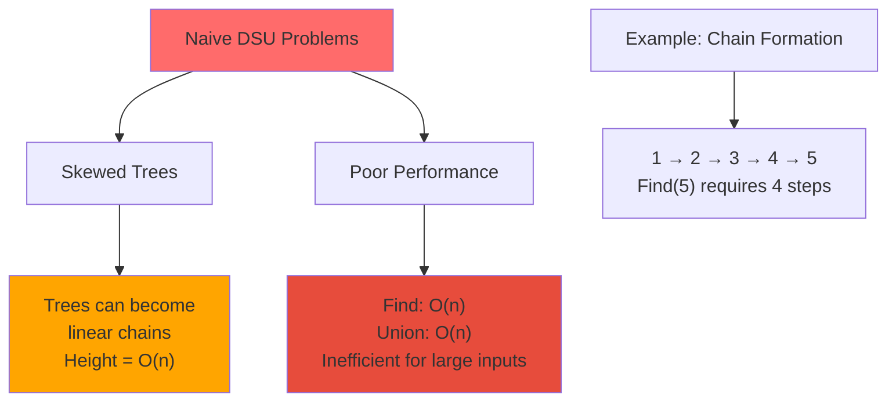
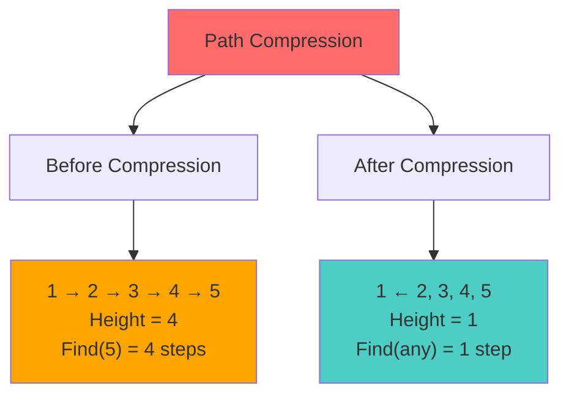
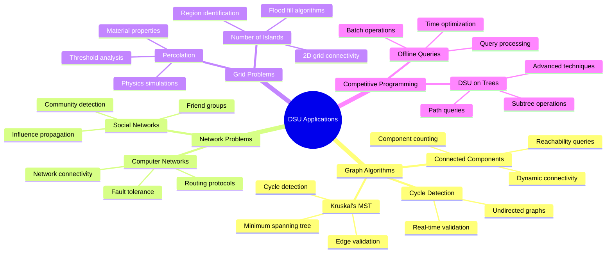
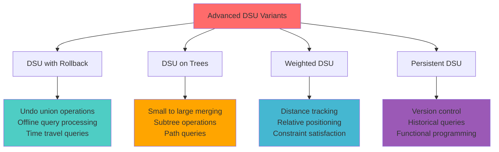
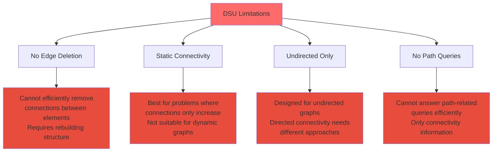
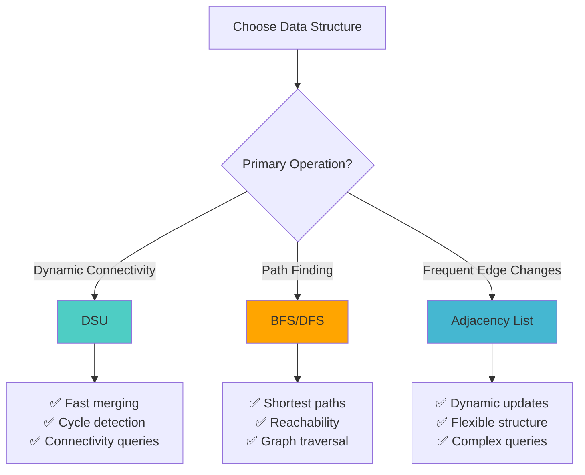
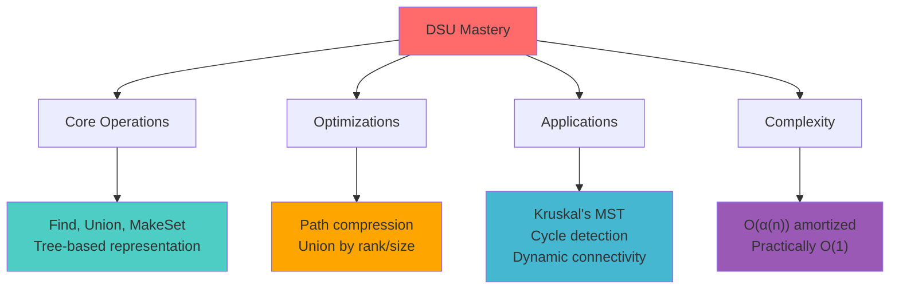

# 🔗 Disjoint Set Union (DSU) — Complete Professional Guide

<div align="center">


*Master the most efficient data structure for dynamic connectivity and graph algorithms*

</div>

---

## 📑 Table of Contents

1. [🎯 Introduction](#-introduction)
2. [🔧 Core Operations](#-core-operations)
3. [💻 Basic Implementation](#-basic-implementation)
4. [🚀 Optimizations](#-optimizations)
5. [⚡ Combined Optimization](#-combined-optimization)
6. [📊 Complexity Analysis](#-complexity-analysis)
7. [🌟 Applications](#-applications)
8. [🌳 Kruskal's Algorithm](#-kruskals-algorithm)
9. [🔥 Advanced Variants](#-advanced-variants)
10. [⚖️ Limitations](#️-limitations)
11. [🆚 Comparisons](#-comparisons)
12. [🧠 Interview Tips](#-interview-tips)

---

## 🎯 Introduction

### 🔷 What is Disjoint Set Union (DSU)?

**Disjoint Set Union (DSU)**, also known as **Union-Find**, is a data structure that maintains a collection of **disjoint (non-overlapping) sets** and supports efficient operations to merge sets and find which set an element belongs to.

```mermaid
flowchart TD
    A[Disjoint Set Union] --> B[Collection of Sets]
    B --> C[Set 1: {1, 3, 5}]
    B --> D[Set 2: {2, 4}]
    B --> E[Set 3: {6, 7, 8}]
    
    F[Core Operations] --> G[Find(x)]
    F --> H[Union(x, y)]
    
    G --> I["Determine which set<br/>element x belongs to"]
    H --> J["Merge sets containing<br/>elements x and y"]
    
    style A fill:#ff6b6b
    style F fill:#4ecdc4
    style I fill:#ffa500
    style J fill:#45b7d1
```

### 🎯 Key Properties

```mermaid
mindmap
  root((DSU Properties))
    Disjoint Sets
      No overlapping elements
      Each element in exactly one set
      Sets are mutually exclusive
    Dynamic Operations
      Add new sets
      Merge existing sets
      Query membership
    Efficiency
      Near constant time
      Amortized O(α(n))
      Practical performance
```

---

## 🔧 Core Operations

### 📋 Three Fundamental Operations

<div align="center">

</div>

```mermaid
flowchart TD
    A[DSU Operations] --> B[MakeSet(x)]
    A --> C[Find(x)]
    A --> D[Union(x, y)]
    
    B --> B1["Create new set<br/>containing only x<br/>x becomes its own parent"]
    C --> C1["Find representative<br/>(root) of set containing x<br/>Returns set identifier"]
    D --> D1["Merge sets containing<br/>x and y into single set<br/>Connect their roots"]
    
    style A fill:#ff6b6b
    style B1 fill:#4ecdc4
    style C1 fill:#ffa500
    style D1 fill:#45b7d1
```

### 🔧 Operation Details

#### 1️⃣ **MakeSet(x)**: Initialize Element
```cpp
void makeSet(int x) {
    parent[x] = x;  // Element is its own parent
    rank[x] = 0;    // Initial rank is 0
}
```

#### 2️⃣ **Find(x)**: Find Set Representative
```cpp
int find(int x) {
    if (parent[x] != x) {
        return find(parent[x]);  // Recursive search
    }
    return x;  // Found root
}
```

#### 3️⃣ **Union(x, y)**: Merge Two Sets
```cpp
void union(int x, int y) {
    int rootX = find(x);
    int rootY = find(y);
    
    if (rootX != rootY) {
        parent[rootX] = rootY;  // Make one root parent of other
    }
}
```

---

## 💻 Basic Implementation

### 🏗️ Naive DSU Implementation

```cpp
class NaiveDSU {
private:
    vector<int> parent;
    
public:
    NaiveDSU(int n) : parent(n) {
        for (int i = 0; i < n; i++) {
            parent[i] = i;  // Each element is its own parent
        }
    }
    
    int find(int x) {
        if (parent[x] != x) {
            return find(parent[x]);
        }
        return x;
    }
    
    void unite(int x, int y) {
        int rootX = find(x);
        int rootY = find(y);
        
        if (rootX != rootY) {
            parent[rootX] = rootY;
        }
    }
    
    bool connected(int x, int y) {
        return find(x) == find(y);
    }
};
```

### ⚠️ Problems with Naive Implementation



### 📊 Naive Complexity

| Operation | Time Complexity | Space Complexity |
|:----------|:----------------|:-----------------|
| **MakeSet** | O(1) | O(1) |
| **Find** | O(n) worst case | O(n) recursion |
| **Union** | O(n) worst case | O(n) recursion |

---

## 🚀 Optimizations

### 🔥 Optimization 1: Path Compression

<div align="center">

</div>

#### 💡 Core Idea
**While finding the root, make all nodes on the path point directly to the root.**



#### 🔧 Implementation
```cpp
int find(int x) {
    if (parent[x] != x) {
        parent[x] = find(parent[x]);  // Path compression
    }
    return parent[x];
}
```

#### ✨ Benefits
- **Flattens tree structure**
- **Speeds up future Find operations**
- **Amortized O(α(n)) complexity**

### 🔥 Optimization 2: Union by Rank

<div align="center">

</div>

#### 💡 Core Idea
**Always attach the smaller tree under the root of the larger tree.**

```mermaid
flowchart TD
    A[Union by Rank Strategy] --> B[Compare Ranks]
    B --> C{Rank Comparison}
    
    C -->|rank[x] < rank[y]| D["Attach tree x<br/>under root y"]
    C -->|rank[x] > rank[y]| E["Attach tree y<br/>under root x"]
    C -->|rank[x] = rank[y]| F["Attach either<br/>Increment rank"]
    
    G[Benefits] --> H["Prevents skewed trees"]
    G --> I["Maintains balanced structure"]
    G --> J["Logarithmic height guarantee"]
    
    style A fill:#ff6b6b
    style D fill:#4ecdc4
    style E fill:#4ecdc4
    style F fill:#ffa500
```

#### 🔧 Implementation
```cpp
class DSUWithRank {
private:
    vector<int> parent, rank;
    
public:
    DSUWithRank(int n) : parent(n), rank(n, 0) {
        for (int i = 0; i < n; i++) {
            parent[i] = i;
        }
    }
    
    void unite(int x, int y) {
        int rootX = find(x);
        int rootY = find(y);
        
        if (rootX != rootY) {
            if (rank[rootX] < rank[rootY]) {
                parent[rootX] = rootY;
            } else if (rank[rootX] > rank[rootY]) {
                parent[rootY] = rootX;
            } else {
                parent[rootY] = rootX;
                rank[rootX]++;
            }
        }
    }
};
```

### 🔄 Union by Size Alternative

```cpp
class DSUWithSize {
private:
    vector<int> parent, size;
    
public:
    DSUWithSize(int n) : parent(n), size(n, 1) {
        for (int i = 0; i < n; i++) {
            parent[i] = i;
        }
    }
    
    void unite(int x, int y) {
        int rootX = find(x);
        int rootY = find(y);
        
        if (rootX != rootY) {
            if (size[rootX] < size[rootY]) {
                parent[rootX] = rootY;
                size[rootY] += size[rootX];
            } else {
                parent[rootY] = rootX;
                size[rootX] += size[rootY];
            }
        }
    }
    
    int getSize(int x) {
        return size[find(x)];
    }
};
```

---

## ⚡ Combined Optimization

### 🏆 Best Practice: Path Compression + Union by Rank

```cpp
class OptimizedDSU {
private:
    vector<int> parent, rank;
    int components;
    
public:
    OptimizedDSU(int n) : parent(n), rank(n, 0), components(n) {
        for (int i = 0; i < n; i++) {
            parent[i] = i;
        }
    }
    
    int find(int x) {
        if (parent[x] != x) {
            parent[x] = find(parent[x]);  // Path compression
        }
        return parent[x];
    }
    
    bool unite(int x, int y) {
        int rootX = find(x);
        int rootY = find(y);
        
        if (rootX == rootY) return false;  // Already connected
        
        // Union by rank
        if (rank[rootX] < rank[rootY]) {
            parent[rootX] = rootY;
        } else if (rank[rootX] > rank[rootY]) {
            parent[rootY] = rootX;
        } else {
            parent[rootY] = rootX;
            rank[rootX]++;
        }
        
        components--;
        return true;
    }
    
    bool connected(int x, int y) {
        return find(x) == find(y);
    }
    
    int getComponents() {
        return components;
    }
};
```

### 🎯 Why This Combination Works

```mermaid
flowchart LR
    A[Path Compression] --> C[Nearly Flat Trees]
    B[Union by Rank] --> C
    C --> D[O(α(n)) Amortized]
    D --> E[Practically O(1)]
    
    style A fill:#4ecdc4
    style B fill:#ffa500
    style E fill:#45b7d1
```

---

## 📊 Complexity Analysis

### ⏱️ Time Complexity Summary

<div align="center">

| Implementation | MakeSet | Find | Union |
|:---------------|:--------|:-----|:------|
| **Naive** | O(1) | O(n) | O(n) |
| **Path Compression Only** | O(1) | O(log n) | O(log n) |
| **Union by Rank Only** | O(1) | O(log n) | O(log n) |
| **Both Optimizations** | O(1) | **O(α(n))** | **O(α(n))** |

</div>

### 🔢 Inverse Ackermann Function α(n)

```mermaid
flowchart TD
    A[Inverse Ackermann α(n)] --> B[Growth Rate]
    B --> C["α(16) = 3"]
    B --> D["α(65536) = 4"]
    B --> E["α(2^65536) = 5"]
    
    F[Practical Meaning] --> G["For all real-world inputs<br/>α(n) ≤ 4"]
    F --> H["Effectively constant time<br/>O(1) in practice"]
    
    style A fill:#ff6b6b
    style G fill:#4ecdc4
    style H fill:#45b7d1
```

### 💡 Why α(n) is "Almost Constant"

```
The Inverse Ackermann function grows so slowly that:
- For n = 10^80 (atoms in universe), α(n) = 5
- For practical computing, α(n) ≤ 4
- This makes DSU operations effectively O(1)
```

---

## 🌟 Applications

### 🎯 Core Applications



### 🔥 Real-World Examples

#### 1️⃣ **Social Network Analysis**
```cpp
class SocialNetwork {
private:
    OptimizedDSU dsu;
    
public:
    SocialNetwork(int users) : dsu(users) {}
    
    void addFriendship(int user1, int user2) {
        dsu.unite(user1, user2);
    }
    
    bool areFriends(int user1, int user2) {
        return dsu.connected(user1, user2);
    }
    
    int getFriendGroups() {
        return dsu.getComponents();
    }
};
```

#### 2️⃣ **Network Connectivity**
```cpp
class NetworkConnectivity {
private:
    OptimizedDSU dsu;
    
public:
    NetworkConnectivity(int nodes) : dsu(nodes) {}
    
    void addConnection(int node1, int node2) {
        dsu.unite(node1, node2);
    }
    
    bool canCommunicate(int node1, int node2) {
        return dsu.connected(node1, node2);
    }
    
    int getNetworkComponents() {
        return dsu.getComponents();
    }
};
```

---

## 🌳 Kruskal's Algorithm

### 🎯 DSU in Minimum Spanning Tree

```mermaid
flowchart TD
    A[Kruskal's Algorithm] --> B[Sort Edges by Weight]
    B --> C[Process Each Edge]
    C --> D{Same Component?}
    
    D -->|Yes| E[Skip Edge<br/>(Would create cycle)]
    D -->|No| F[Add Edge to MST<br/>Union components]
    
    E --> G{More Edges?}
    F --> H[DSU.unite(u, v)]
    H --> G
    G -->|Yes| C
    G -->|No| I[MST Complete]
    
    style A fill:#ff6b6b
    style F fill:#4ecdc4
    style I fill:#45b7d1
```

### 💻 Implementation

```cpp
struct Edge {
    int u, v, weight;
    bool operator<(const Edge& other) const {
        return weight < other.weight;
    }
};

class KruskalMST {
private:
    OptimizedDSU dsu;
    vector<Edge> edges;
    
public:
    KruskalMST(int n) : dsu(n) {}
    
    void addEdge(int u, int v, int weight) {
        edges.push_back({u, v, weight});
    }
    
    vector<Edge> findMST() {
        sort(edges.begin(), edges.end());
        vector<Edge> mst;
        
        for (const Edge& edge : edges) {
            if (!dsu.connected(edge.u, edge.v)) {
                dsu.unite(edge.u, edge.v);
                mst.push_back(edge);
                
                if (mst.size() == dsu.getComponents() - 1) {
                    break;  // MST complete
                }
            }
        }
        
        return mst;
    }
};
```

### 🎯 Why DSU is Perfect for Kruskal's

```mermaid
flowchart LR
    A[Fast Cycle Detection] --> D[Efficient MST]
    B[Dynamic Merging] --> D
    C[O(α(n)) Operations] --> D
    
    style D fill:#4ecdc4
```

---

## 🔥 Advanced Variants

### 🚀 Advanced DSU Techniques



### 1️⃣ **DSU with Rollback**

```cpp
class RollbackDSU {
private:
    vector<int> parent, rank;
    stack<pair<int, pair<int, int>>> history;  // {node, {old_parent, old_rank}}
    
public:
    RollbackDSU(int n) : parent(n), rank(n, 0) {
        for (int i = 0; i < n; i++) {
            parent[i] = i;
        }
    }
    
    int find(int x) {
        while (parent[x] != x) {
            x = parent[x];
        }
        return x;
    }
    
    bool unite(int x, int y) {
        x = find(x);
        y = find(y);
        
        if (x == y) return false;
        
        if (rank[x] < rank[y]) swap(x, y);
        
        history.push({y, {parent[y], rank[x]}});
        parent[y] = x;
        if (rank[x] == rank[y]) rank[x]++;
        
        return true;
    }
    
    void rollback() {
        if (history.empty()) return;
        
        auto [node, old_state] = history.top();
        history.pop();
        
        parent[node] = old_state.first;
        if (old_state.second != rank[find(node)]) {
            rank[find(node)]--;
        }
    }
};
```

### 2️⃣ **DSU with Size Tracking**

```cpp
class DSUWithSizeTracking {
private:
    vector<int> parent, size;
    
public:
    DSUWithSizeTracking(int n) : parent(n), size(n, 1) {
        iota(parent.begin(), parent.end(), 0);
    }
    
    int find(int x) {
        return parent[x] == x ? x : parent[x] = find(parent[x]);
    }
    
    bool unite(int x, int y) {
        x = find(x);
        y = find(y);
        
        if (x == y) return false;
        
        if (size[x] < size[y]) swap(x, y);
        parent[y] = x;
        size[x] += size[y];
        
        return true;
    }
    
    int getSize(int x) {
        return size[find(x)];
    }
};
```

---

## ⚖️ Limitations

### 🚫 DSU Limitations



### 🔄 When NOT to Use DSU

```
❌ Dynamic edge deletion required
❌ Directed graph connectivity
❌ Path finding between nodes
❌ Shortest path queries
❌ Frequent structural changes
```

---

## 🆚 Comparisons

### 📊 DSU vs Other Data Structures

<div align="center">

| Feature | DSU | BFS/DFS | Adjacency List |
|:--------|:----|:--------|:---------------|
| **Dynamic Merging** | ✅ O(α(n)) | ❌ O(V+E) | ❌ O(V+E) |
| **Cycle Detection** | ✅ O(α(n)) | ✅ O(V+E) | ✅ O(V+E) |
| **Query Speed** | ✅ Very Fast | ❌ Slower | ❌ Slower |
| **Edge Deletion** | ❌ Inefficient | ✅ O(1) | ✅ O(1) |
| **Path Finding** | ❌ No | ✅ Yes | ✅ Yes |
| **Memory Usage** | ✅ O(V) | ✅ O(V) | ❌ O(V+E) |

</div>

### 🎯 Decision Matrix



---

## 🧠 Interview Tips

### 🎯 Common Interview Questions

#### Q1: What is DSU and why is it useful?
```
A: "DSU is a data structure that efficiently maintains disjoint sets
   and supports union and find operations in nearly constant time.
   It's perfect for dynamic connectivity problems and cycle detection."
```

#### Q2: How does path compression work?
```
A: "Path compression flattens the tree during find operations by making
   all nodes on the path point directly to the root. This speeds up
   future operations by reducing tree height."
```

#### Q3: Why is DSU almost O(1)?
```
A: "With path compression and union by rank, DSU achieves O(α(n))
   amortized time complexity, where α(n) is the inverse Ackermann
   function. This grows so slowly that it's ≤ 4 for all practical
   inputs, making it effectively constant time."
```

### 💡 Interview Success Tips

#### ✅ Do's
```
✓ Explain both optimizations clearly
✓ Mention α(n) complexity and its practical meaning
✓ Discuss applications like Kruskal's algorithm
✓ Show understanding of when to use DSU
✓ Implement clean, optimized code
```

#### ❌ Don'ts
```
✗ Don't forget path compression in implementation
✗ Don't confuse union by rank with union by size
✗ Don't claim DSU works for directed graphs
✗ Don't ignore the limitations
✗ Don't implement naive version in interviews
```

### 🔥 Quick Implementation Template

```cpp
class DSU {
    vector<int> parent, rank;
public:
    DSU(int n) : parent(n), rank(n, 0) {
        iota(parent.begin(), parent.end(), 0);
    }
    
    int find(int x) {
        return parent[x] == x ? x : parent[x] = find(parent[x]);
    }
    
    bool unite(int x, int y) {
        x = find(x), y = find(y);
        if (x == y) return false;
        if (rank[x] < rank[y]) swap(x, y);
        parent[y] = x;
        if (rank[x] == rank[y]) rank[x]++;
        return true;
    }
    
    bool connected(int x, int y) {
        return find(x) == find(y);
    }
};
```

### 🎯 Problem-Solving Patterns

#### Pattern 1: **Dynamic Connectivity**
```
Problem: Check if two nodes are connected
Solution: Use find(x) == find(y)
```

#### Pattern 2: **Cycle Detection**
```
Problem: Detect cycle in undirected graph
Solution: If find(u) == find(v) before union, cycle exists
```

#### Pattern 3: **Component Counting**
```
Problem: Count connected components
Solution: Track components, decrement on successful union
```

---

## 📚 Practice Problems

### 🔥 LeetCode Problems

#### **Easy**
- Number of Connected Components (323)
- Friend Circles (547)

#### **Medium**
- Accounts Merge (721)
- Number of Islands II (305)
- Redundant Connection (684)

#### **Hard**
- Optimize Water Distribution (1168)
- Checking Existence of Edge Length Limited Paths (1697)

### 🧠 Conceptual Questions

1. **Design**: "Design a data structure for dynamic connectivity with undo operations."

2. **Optimization**: "How would you modify DSU to support range unions efficiently?"

3. **Application**: "Explain how DSU is used in Kruskal's algorithm and why it's optimal."

---

## 📊 Summary & Key Takeaways

### 🌟 Essential Knowledge



### 🎯 One-Line Exam Answers

- **DSU Purpose**: Maintains disjoint sets efficiently
- **Path Compression**: Flattens trees during find operations
- **Union by Rank**: Minimizes tree height by smart merging
- **Time Complexity**: O(α(n)) amortized, practically O(1)
- **Best Application**: Kruskal's algorithm for MST

### 🔥 Interview Success Formula

```
1. 🎯 Master both optimizations (path compression + union by rank)
2. ⚡ Understand α(n) and why it's "almost constant"
3. 🌳 Know Kruskal's algorithm application
4. 🔧 Implement clean, optimized code
5. 📊 Discuss limitations and alternatives
6. 💡 Recognize DSU patterns in problems
```

---

<div align="center">

### 🌟 Master DSU = Master Dynamic Connectivity!

**🔗 From theory to advanced applications — your complete guide to Union-Find mastery**

*"In competitive programming and system design, DSU is the bridge between theoretical efficiency and practical performance."*

</div>