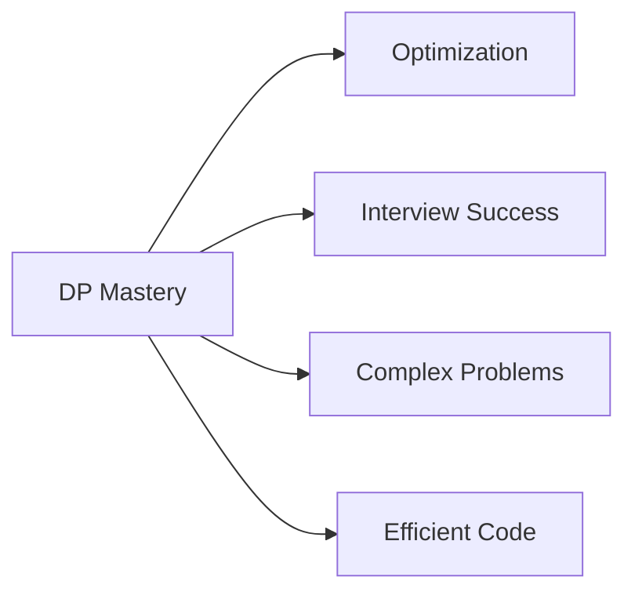

<div align="center">

# 🚀 Day 12: Dynamic Programming Fundamentals

*Mastering the Art of Optimization Through Intelligent Memoization*

---


</div>

---

## 🎯 **Learning Objectives**

> *Transform exponential problems into polynomial solutions through strategic memoization*

- 🧠 Understand Dynamic Programming principles
- 🔄 Master Top-Down and Bottom-Up approaches
- 📊 Identify DP problem patterns
- ⚡ Optimize recursive solutions

---

## 📖 **1. What is Dynamic Programming?**

<table>
<tr>
<td width="50%">

### 🧠 **Core Concept**
*Optimization technique for solving complex problems*

**Key Principle:**
- 🔄 Break into subproblems
- 💾 Store computed results
- ♻️ Reuse stored solutions

</td>
<td width="50%">

### ⚡ **The Magic Formula**
*Recursion + Memoization = Dynamic Programming*

**Transformation:**
- 📈 Exponential → Polynomial
- 🚀 Slow → Fast
- 💡 Repeated → Cached

</td>
</tr>
</table>

### 🌟 **Why DP Matters?**



---

## 🔥 **2. When to Use Dynamic Programming?**

### 📊 **Two Essential Properties**

<div align="center">

| Property | Description | Example |
|:---------|:------------|:--------|
| **🏗️ Optimal Substructure** | Optimal solution built from optimal subproblems | Fibonacci: F(n) = F(n-1) + F(n-2) |
| **🔄 Overlapping Subproblems** | Same subproblems solved multiple times | Recursive Fibonacci recalculates F(2), F(3)... |

</div>

### ✅ **DP Identification Checklist**

> 🎯 **Can I break this into smaller decisions?**  
> 🔄 **Do I solve the same thing multiple times?**  
> 📊 **Do results depend on previous choices?**  
> ❌ **Does greedy approach fail here?**  
> 🔁 **Does recursion repeat subproblems?**  

**If YES to most → Use Dynamic Programming!**

---

## 🧩 **3. DP Approaches**

### 📌 **Two Main Strategies**

<table>
<tr>
<td width="50%">

#### 🔝 **Top-Down (Memoization)**

**Characteristics:**
- 🔄 Recursive approach
- 💾 Cache results in table
- 📝 Easy to write
- 🎯 Solve on demand

**Process:**
```
1. Write recursive solution
2. Add memoization table
3. Check cache before computing
4. Store result after computing
```

</td>
<td width="50%">

#### ⬇️ **Bottom-Up (Tabulation)**

**Characteristics:**
- 🔁 Iterative approach
- 📊 Build table systematically
- ⚡ Faster (no recursion)
- 🎯 Solve all subproblems

**Process:**
```
1. Initialize DP table
2. Define base cases
3. Fill table iteratively
4. Return final answer
```

</td>
</tr>
</table>

---

## 📊 **4. Complexity Analysis**

### ⏱️ **Performance Comparison**

<div align="center">

| Method | Time Complexity | Space Complexity | Performance |
|:-------|:----------------|:-----------------|:------------|
| **Naive Recursion** | O(2ⁿ) | O(n) stack | 🔴 Very Poor |
| **Memoization** | O(n) to O(n²) | O(n) to O(n²) | 🟢 Excellent |
| **Tabulation** | O(n) to O(n²) | O(n) to O(n²) | 🟢 Excellent |
| **Space Optimized** | O(n) to O(n²) | O(1) to O(n) | 🟢 Best |

</div>

---

## 🧱 **5. Common DP Patterns**

### 📊 **Pattern Classification**

<div align="center">

| Pattern | State Definition | Examples | Difficulty |
|:--------|:----------------|:---------|:-----------|
| **🔢 1D DP** | dp[i] | Fibonacci, Climbing Stairs, House Robber | 🟢 Easy |
| **📊 2D DP** | dp[i][j] | Unique Paths, Min Path Sum, LCS | 🟡 Medium |
| **🎲 Knapsack** | dp[i][w] | 0/1 Knapsack, Subset Sum | 🟡 Medium |
| **🔤 String DP** | dp[i][j] | Edit Distance, LCS, Palindrome | 🟡 Medium |
| **📈 Subsequence** | dp[i] | LIS, Max Subarray | 🟡 Medium |
| **🎭 Bitmask DP** | dp[mask] | TSP, Assignment Problem | 🔴 Hard |

</div>

### 🎯 **Pattern Details**

<table>
<tr>
<td width="50%">

#### 🔢 **1D DP Pattern**
**State:** `dp[i]`  
**Transition:** `dp[i] = f(dp[i-1], dp[i-2]...)`

**Classic Problems:**
- Fibonacci Numbers
- Climbing Stairs
- House Robber
- Min Cost Climbing Stairs

</td>
<td width="50%">

#### 📊 **2D DP Pattern**
**State:** `dp[i][j]`  
**Transition:** `dp[i][j] = f(dp[i-1][j], dp[i][j-1])`

**Classic Problems:**
- Unique Paths
- Minimum Path Sum
- Longest Common Subsequence
- Edit Distance

</td>
</tr>
<tr>
<td width="50%">

#### 🎲 **Knapsack Pattern**
**State:** `dp[i][w]`  
**Transition:** Include/Exclude item

**Classic Problems:**
- 0/1 Knapsack
- Subset Sum
- Partition Equal Subset
- Target Sum

</td>
<td width="50%">

#### 🔤 **String DP Pattern**
**State:** `dp[i][j]` for substrings  
**Transition:** Match/Mismatch characters

**Classic Problems:**
- Longest Common Subsequence
- Edit Distance
- Palindromic Substrings
- Wildcard Matching

</td>
</tr>
</table>

---

## 🔥 **6. Steps to Solve DP Problems**

### 📋 **Systematic Approach**

<table>
<tr>
<td width="33%">

#### **Step 1-2**
**🎯 Identify State**
- What changes?
- What do we track?
- Define dp[...]

**🔗 Find Recurrence**
- How states relate?
- Write formula
- Connect subproblems

</td>
<td width="33%">

#### **Step 3-4**
**🏁 Base Cases**
- Smallest subproblem
- Initial values
- Edge conditions

**⚙️ Choose Approach**
- Top-Down or Bottom-Up?
- Recursion or Iteration?
- Consider constraints

</td>
<td width="33%">

#### **Step 5-6**
**💻 Implementation**
- Write clean code
- Test thoroughly
- Debug carefully

**🚀 Optimization**
- Space optimization
- Rolling array
- Constant space

</td>
</tr>
</table>

---

## 📘 **7. Classic DP Problems**

### 🎯 **Curated Problem List**

<div align="center">

| Difficulty | Problem | Pattern | Priority |
|:-----------|:--------|:--------|:---------|
| **🟢 Easy** | Fibonacci Numbers | 1D DP | ⭐⭐⭐ |
| **🟢 Easy** | Climbing Stairs | 1D DP | ⭐⭐⭐ |
| **🟢 Easy** | House Robber | 1D DP | ⭐⭐⭐ |
| **🟢 Easy** | Min Cost Climbing Stairs | 1D DP | ⭐⭐ |
| **🟡 Medium** | Coin Change | 1D DP | ⭐⭐⭐ |
| **🟡 Medium** | Longest Increasing Subsequence | 1D DP | ⭐⭐⭐ |
| **🟡 Medium** | Unique Paths | 2D DP | ⭐⭐⭐ |
| **🟡 Medium** | Longest Common Subsequence | 2D DP | ⭐⭐⭐ |
| **🟡 Medium** | Edit Distance | 2D DP | ⭐⭐ |
| **🟡 Medium** | Partition Equal Subset | Knapsack | ⭐⭐ |
| **🔴 Hard** | Wildcard Matching | String DP | ⭐ |
| **🔴 Hard** | Burst Balloons | Interval DP | ⭐ |

</div>

---

## 💡 **8. Real-World Applications**

<table>
<tr>
<td width="50%">

### 🌍 **Industry Use Cases**
- 📈 Stock trading optimization
- 🗺️ GPS route planning
- 🔤 Spell checkers (Edit Distance)
- 🧬 DNA sequence alignment
- ⌨️ Predictive text input

</td>
<td width="50%">

### 🎯 **Technical Applications**
- 🎮 Game AI decision making
- 📊 Resource allocation
- 🔧 Compiler optimization
- 🌐 Network routing
- 💾 Cache management

</td>
</tr>
</table>

---

## 🎯 **9. Key Takeaways**

<div align="center">

### 💡 **Essential Insights**

</div>

> 🧠 **DP = Recursion + Memoization**: Master both concepts  
> 🔄 **Identify Patterns**: Recognize overlapping subproblems  
> 📊 **State Definition**: Clear state leads to clear solution  
> ⚡ **Practice Regularly**: Pattern recognition comes with practice  

---

## 📚 **10. Next Steps**

<table>
<tr>
<td width="50%">

### 🎯 **Immediate Goals**
- [ ] Solve Fibonacci with DP
- [ ] Master Climbing Stairs
- [ ] Practice House Robber
- [ ] Understand memoization

</td>
<td width="50%">

### 🚀 **Long-term Objectives**
- [ ] Master all DP patterns
- [ ] Solve 50+ DP problems
- [ ] Learn space optimization
- [ ] Tackle hard problems

</td>
</tr>
</table>

---

<div align="center">

### 📊 **Learning Progress**


---

**📅 Session Date**: Day 12 | **🎯 Focus**: Dynamic Programming | **⏰ Duration**: Deep Learning Session

*"Dynamic Programming: Where recursion meets intelligence"*

</div>
