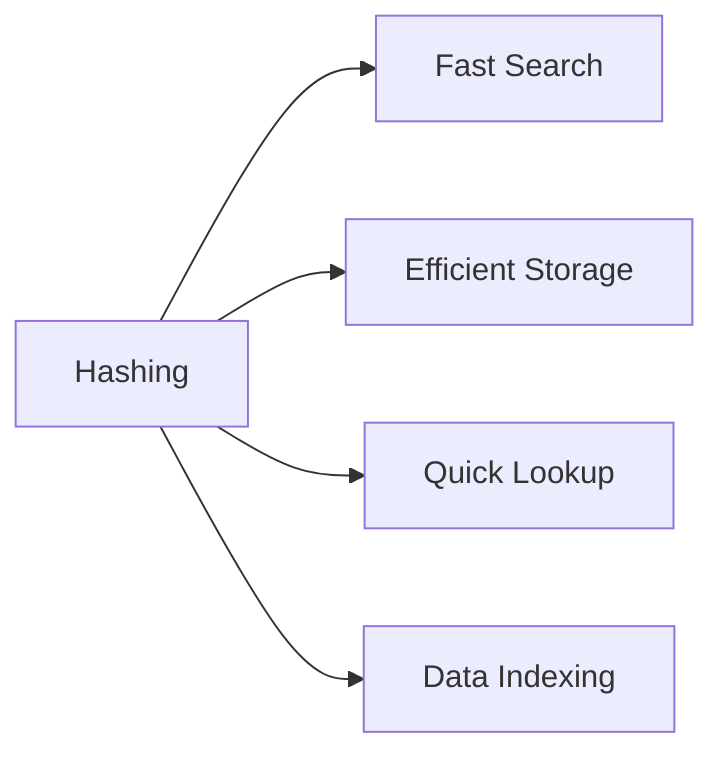

<div align="center">

# 🚀 Day 13: Hashing Fundamentals

*Mastering Constant-Time Data Access Through Hash Tables*

---


</div>

---

## 🎯 **Learning Objectives**

> *Achieve O(1) average-case operations through intelligent hashing*

- 🔐 Understand hashing principles and hash functions
- 🗂️ Master hash table implementation
- ⚠️ Handle collisions effectively
- 🎯 Apply hashing to solve real problems

---

## 📖 **1. What is Hashing?**

<table>
<tr>
<td width="50%">

### 🔐 **Core Concept**
*Technique to map data to fixed-size values*

**Key Components:**
- 🔑 Hash Function
- 🗂️ Hash Table
- 🎯 Hash Value/Code

</td>
<td width="50%">

### ⚡ **The Power of Hashing**
*Transform large keys into small indices*

**Benefits:**
- 🚀 O(1) average operations
- 💾 Efficient storage
- 🔍 Fast retrieval

</td>
</tr>
</table>

### 🌟 **Why Hashing Matters?**



---

## 🔢 **2. Hash Functions**

### 📊 **Properties of Good Hash Function**

<div align="center">

| Property | Description | Importance |
|:---------|:------------|:-----------|
| **⚡ Fast Computation** | Quick to calculate | 🟢 Critical |
| **🎯 Uniform Distribution** | Spreads keys evenly | 🟢 Critical |
| **🔄 Deterministic** | Same input → same output | 🟢 Critical |
| **⚠️ Minimize Collisions** | Different keys → different hashes | 🟡 Important |

</div>

### 🧮 **Common Hash Functions**

<table>
<tr>
<td width="50%">

#### **Division Method**
```
hash(key) = key % table_size
```

**Pros:**
- Simple and fast
- Easy to implement

**Cons:**
- Poor distribution if table_size not prime

</td>
<td width="50%">

#### **Multiplication Method**
```
hash(key) = floor(m * (key * A mod 1))
```

**Pros:**
- Better distribution
- Works with any table size

**Cons:**
- Slightly slower

</td>
</tr>
</table>

---

## ⚠️ **3. Collision Handling**

### 🎯 **What is a Collision?**

> When two different keys produce the same hash value

**Example:**
```
hash(10) = 10 % 7 = 3
hash(17) = 17 % 7 = 3  ← Collision!
```

### 🛠️ **Collision Resolution Techniques**

<div align="center">

| Technique | Method | Time Complexity | Space |
|:----------|:-------|:----------------|:------|
| **🔗 Chaining** | Linked list at each slot | O(1 + α) | Extra |
| **📍 Linear Probing** | Next available slot | O(1/(1-α)) | None |
| **📐 Quadratic Probing** | Quadratic jumps | O(1/(1-α)) | None |
| **🔄 Double Hashing** | Second hash function | O(1/(1-α)) | None |

</div>

### 🔗 **1. Separate Chaining**

<table>
<tr>
<td width="50%">

**Concept:**
- Each slot stores a linked list
- Colliding elements added to list

**Advantages:**
- Simple implementation
- Never fills up
- Good for high load factor

</td>
<td width="50%">

**Structure:**
```
Index 0: [10] → [17] → [24]
Index 1: [11] → [18]
Index 2: [12]
Index 3: [13] → [20]
```

**Operations:**
- Insert: O(1)
- Search: O(1 + α)
- Delete: O(1 + α)

</td>
</tr>
</table>

### 📍 **2. Open Addressing**

<table>
<tr>
<td width="33%">

#### **Linear Probing**
```
h(k, i) = (h(k) + i) % m
```

**Pros:**
- Cache friendly
- Simple

**Cons:**
- Primary clustering

</td>
<td width="33%">

#### **Quadratic Probing**
```
h(k, i) = (h(k) + c₁i + c₂i²) % m
```

**Pros:**
- Reduces clustering
- Better distribution

**Cons:**
- Secondary clustering

</td>
<td width="33%">

#### **Double Hashing**
```
h(k, i) = (h₁(k) + i·h₂(k)) % m
```

**Pros:**
- Best distribution
- Minimal clustering

**Cons:**
- More computation

</td>
</tr>
</table>

---

## 📏 **4. Load Factor**

### 📊 **Understanding Load Factor**

<div align="center">

**Formula:** `α = n / m`

where:
- `n` = number of elements
- `m` = table size

</div>

<table>
<tr>
<td width="50%">

### 🎯 **Optimal Range**

| Load Factor | Performance | Action |
|:------------|:------------|:-------|
| **α < 0.5** | 🟢 Excellent | Good |
| **0.5 ≤ α < 0.7** | 🟡 Good | Monitor |
| **0.7 ≤ α < 0.9** | 🟠 Fair | Consider resize |
| **α ≥ 0.9** | 🔴 Poor | Resize now |

</td>
<td width="50%">

### 🔄 **Rehashing**

**When to Rehash:**
- Load factor exceeds threshold
- Too many collisions

**Process:**
1. Create larger table (2x size)
2. Rehash all existing elements
3. Replace old table

**Cost:** O(n) amortized

</td>
</tr>
</table>

---

## ⏱️ **5. Time Complexity**

### 📊 **Performance Analysis**

<div align="center">

| Operation | Average Case | Worst Case | Best Case |
|:----------|:-------------|:-----------|:----------|
| **🔍 Search** | O(1) | O(n) | O(1) |
| **➕ Insert** | O(1) | O(n) | O(1) |
| **➖ Delete** | O(1) | O(n) | O(1) |
| **🔄 Rehash** | O(n) | O(n) | O(n) |

</div>

### 📈 **Space Complexity**

| Method | Space | Notes |
|:-------|:------|:------|
| **Chaining** | O(n + m) | Extra space for pointers |
| **Open Addressing** | O(m) | No extra pointers |

---

## 🗂️ **6. Applications of Hashing**

<table>
<tr>
<td width="50%">

### 🌍 **Real-World Uses**
- 🔐 Password storage (cryptographic)
- 💾 Database indexing
- 🚀 Caching systems (LRU)
- 🔍 Search engines
- 🌐 DNS resolution

</td>
<td width="50%">

### 💻 **Programming Applications**
- 📊 Frequency counting
- 🔄 Duplicate detection
- 🎯 Anagram checking
- 🔗 Symbol tables (compilers)
- 📝 Spell checkers

</td>
</tr>
</table>

---

## 🎯 **7. Hash-Based Data Structures**

### 📚 **Common Implementations**

<div align="center">

| Structure | Language | Ordered | Duplicates | Use Case |
|:----------|:---------|:--------|:-----------|:---------|
| **unordered_map** | C++ | ❌ | ❌ | Key-value pairs |
| **unordered_set** | C++ | ❌ | ❌ | Unique elements |
| **HashMap** | Java | ❌ | ❌ | Key-value pairs |
| **HashSet** | Java | ❌ | ❌ | Unique elements |
| **dict** | Python | ❌ | ❌ | Key-value pairs |
| **set** | Python | ❌ | ❌ | Unique elements |

</div>

---

## 🎯 **8. Classic Hashing Problems**

### 📘 **Must-Solve Problems**

<div align="center">

| Difficulty | Problem | Pattern | Priority |
|:-----------|:--------|:--------|:---------|
| **🟢 Easy** | Two Sum | Hash Map | ⭐⭐⭐ |
| **🟢 Easy** | Contains Duplicate | Hash Set | ⭐⭐⭐ |
| **🟢 Easy** | Valid Anagram | Frequency Map | ⭐⭐⭐ |
| **🟡 Medium** | Group Anagrams | Hash Map | ⭐⭐⭐ |
| **🟡 Medium** | Subarray Sum Equals K | Prefix Sum + Hash | ⭐⭐⭐ |
| **🟡 Medium** | Longest Consecutive Sequence | Hash Set | ⭐⭐ |
| **🟡 Medium** | 4Sum II | Hash Map | ⭐⭐ |
| **🔴 Hard** | Substring with Concatenation | Sliding Window + Hash | ⭐ |

</div>

---

## 🧠 **9. Characteristics of Good Hash Table**

<div align="center">

### 💡 **Design Principles**

</div>

> ⚡ **Fast Operations**: O(1) average case  
> 🎯 **Good Hash Function**: Uniform distribution  
> 📏 **Proper Load Factor**: Keep α < 0.75  
> 🛠️ **Collision Handling**: Efficient resolution  
> 🔄 **Dynamic Resizing**: Rehash when needed  

---

## 🎯 **10. Key Takeaways**

<div align="center">

### 💡 **Essential Insights**

</div>

> 🔐 **Hashing = Fast Access**: O(1) average operations  
> ⚠️ **Collisions are Inevitable**: Handle them properly  
> 📏 **Load Factor Matters**: Monitor and resize  
> 🎯 **Choose Right Method**: Chaining vs Open Addressing  

---

## 📚 **11. Next Steps**

<table>
<tr>
<td width="50%">

### 🎯 **Immediate Goals**
- [ ] Implement hash table from scratch
- [ ] Solve Two Sum problem
- [ ] Practice collision handling
- [ ] Master unordered_map/dict

</td>
<td width="50%">

### 🚀 **Long-term Objectives**
- [ ] Solve 20+ hashing problems
- [ ] Learn cryptographic hashing
- [ ] Implement LRU cache
- [ ] Master advanced patterns

</td>
</tr>
</table>

---

<div align="center">

### 📊 **Learning Progress**


---

**📅 Session Date**: Day 13 | **🎯 Focus**: Hashing | **⏰ Duration**: Deep Learning Session

*"Hashing: Where speed meets efficiency"*

</div>
