# 🔐 Hashing — Complete Professional Guide

<div align="center">


**Master hash tables for O(1) average-case operations**

</div>

---

## 🎯 Introduction

**Hashing** is a technique that maps keys to array indices using a hash function, enabling fast data retrieval.

### 🔑 Hash Table Components


### 💻 Basic Implementation

```cpp
class HashTable {
private:
    struct Node {
        int key;
        int value;
        Node* next;
        
        Node(int k, int v) : key(k), value(v), next(nullptr) {}
    };
    
    vector<Node*> table;
    int capacity;
    int size;
    
    int hashFunction(int key) {
        return abs(key) % capacity;
    }
    
public:
    HashTable(int cap = 10) : capacity(cap), size(0) {
        table.resize(capacity, nullptr);
    }
    
    void insert(int key, int value) {
        int index = hashFunction(key);
        
        if (!table[index]) {
            table[index] = new Node(key, value);
            size++;
        } else {
            Node* current = table[index];
            while (current) {
                if (current->key == key) {
                    current->value = value; // Update existing
                    return;
                }
                if (!current->next) break;
                current = current->next;
            }
            current->next = new Node(key, value);
            size++;
        }
    }
    
    bool search(int key, int& value) {
        int index = hashFunction(key);
        Node* current = table[index];
        
        while (current) {
            if (current->key == key) {
                value = current->value;
                return true;
            }
            current = current->next;
        }
        
        return false;
    }
    
    bool remove(int key) {
        int index = hashFunction(key);
        
        if (!table[index]) return false;
        
        if (table[index]->key == key) {
            Node* temp = table[index];
            table[index] = table[index]->next;
            delete temp;
            size--;
            return true;
        }
        
        Node* current = table[index];
        while (current->next) {
            if (current->next->key == key) {
                Node* temp = current->next;
                current->next = current->next->next;
                delete temp;
                size--;
                return true;
            }
            current = current->next;
        }
        
        return false;
    }
};
```

---

## 🎯 Hash Functions

<div align="center">

</div>

### 🔧 Hash Function Properties


```cpp
class HashFunctions {
public:
    // Division method
    int divisionHash(int key, int tableSize) {
        return abs(key) % tableSize;
    }
    
    // Multiplication method
    int multiplicationHash(int key, int tableSize) {
        const double A = 0.6180339887; // (sqrt(5) - 1) / 2
        double fractional = key * A - floor(key * A);
        return floor(tableSize * fractional);
    }
    
    // String hash function
    int stringHash(const string& str, int tableSize) {
        int hash = 0;
        int prime = 31;
        
        for (char c : str) {
            hash = (hash * prime + c) % tableSize;
        }
        
        return abs(hash);
    }
    
    // Polynomial rolling hash
    long long rollingHash(const string& str) {
        long long hash = 0;
        long long prime = 31;
        long long mod = 1e9 + 7;
        long long power = 1;
        
        for (char c : str) {
            hash = (hash + (c * power) % mod) % mod;
            power = (power * prime) % mod;
        }
        
        return hash;
    }
};
```

---

## 🎯 Collision Resolution

<div align="center">

</div>

### 🔧 Collision Resolution Strategies

```mermaid
flowchart TD
    A["Collision Resolution"] --> B["Chaining"]
    A --> C["Open Addressing"]
    
    B --> D["Linked Lists"]
    B --> E["Dynamic Arrays"]
    B --> F["Balanced Trees"]
    
    C --> G["Linear Probing"]
    C --> H["Quadratic Probing"]
    C --> I["Double Hashing"]
    
    D --> J["Simple implementation"]
    D --> K["No table size limit"]
    
    G --> L["Next available slot"]
    G --> M["Primary clustering"]
    
    H --> N["i² step size"]
    H --> O["Reduces clustering"]
    
    I --> P["Second hash function"]
    I --> Q["Best distribution"]
    
    style A fill:#e3f2fd
    style B fill:#c8e6c9
    style C fill:#fff3e0
```



```cpp
// Open Addressing - Linear Probing
class LinearProbingHashTable {
private:
    struct Entry {
        int key;
        int value;
        bool deleted;
        
        Entry() : key(-1), value(-1), deleted(false) {}
        Entry(int k, int v) : key(k), value(v), deleted(false) {}
    };
    
    vector<Entry> table;
    int capacity;
    int size;
    
    int hashFunction(int key) {
        return abs(key) % capacity;
    }
    
public:
    LinearProbingHashTable(int cap = 10) : capacity(cap), size(0) {
        table.resize(capacity);
    }
    
    void insert(int key, int value) {
        if (size >= capacity * 0.7) { // Load factor check
            resize();
        }
        
        int index = hashFunction(key);
        
        while (table[index].key != -1 && !table[index].deleted) {
            if (table[index].key == key) {
                table[index].value = value;
                return;
            }
            index = (index + 1) % capacity;
        }
        
        table[index] = Entry(key, value);
        size++;
    }
    
    bool search(int key, int& value) {
        int index = hashFunction(key);
        int originalIndex = index;
        
        while (table[index].key != -1) {
            if (table[index].key == key && !table[index].deleted) {
                value = table[index].value;
                return true;
            }
            index = (index + 1) % capacity;
            if (index == originalIndex) break;
        }
        
        return false;
    }
    
private:
    void resize() {
        vector<Entry> oldTable = table;
        capacity *= 2;
        table.clear();
        table.resize(capacity);
        size = 0;
        
        for (const Entry& entry : oldTable) {
            if (entry.key != -1 && !entry.deleted) {
                insert(entry.key, entry.value);
            }
        }
    }
};
```

---

## 🎯 Applications

<div align="center">

</div>

<div align="center">

</div>

### 🔧 Hash Table Use Cases

```mermaid
flowchart TD
    A["🔐 Hash Table Applications"] --> B["📊 Database Indexing"]
    A --> C["💾 Caching Systems"]
    A --> D["🔍 Search & Retrieval"]
    A --> E["🔢 Algorithm Optimization"]
    A --> F["🌐 Distributed Systems"]
    
    B --> G["Primary keys"]
    B --> H["Foreign keys"]
    B --> I["Query optimization"]
    B --> J["B+ tree alternatives"]
    
    C --> K["LRU Cache"]
    C --> L["Web caching"]
    C --> M["Memory caching"]
    C --> N["CDN systems"]
    
    D --> O["Symbol tables"]
    D --> P["Dictionary lookup"]
    D --> Q["Spell checkers"]
    D --> R["Autocomplete"]
    
    E --> S["Two Sum problems"]
    E --> T["Duplicate detection"]
    E --> U["Frequency counting"]
    E --> V["Set operations"]
    
    F --> W["Consistent hashing"]
    F --> X["Load balancing"]
    F --> Y["Sharding"]
    F --> Z["DHT systems"]
    
    classDef default fill:#333,stroke:#fff,stroke-width:2px,color:#fff
```



```cpp
class HashTableProblems {
public:
    // Two Sum
    vector<int> twoSum(vector<int>& nums, int target) {
        unordered_map<int, int> numToIndex;
        
        for (int i = 0; i < nums.size(); i++) {
            int complement = target - nums[i];
            
            if (numToIndex.count(complement)) {
                return {numToIndex[complement], i};
            }
            
            numToIndex[nums[i]] = i;
        }
        
        return {};
    }
    
    // Group Anagrams
    vector<vector<string>> groupAnagrams(vector<string>& strs) {
        unordered_map<string, vector<string>> groups;
        
        for (const string& str : strs) {
            string key = str;
            sort(key.begin(), key.end());
            groups[key].push_back(str);
        }
        
        vector<vector<string>> result;
        for (const auto& pair : groups) {
            result.push_back(pair.second);
        }
        
        return result;
    }
    
    // Longest Consecutive Sequence
    int longestConsecutive(vector<int>& nums) {
        unordered_set<int> numSet(nums.begin(), nums.end());
        int maxLength = 0;
        
        for (int num : numSet) {
            if (!numSet.count(num - 1)) { // Start of sequence
                int currentNum = num;
                int currentLength = 1;
                
                while (numSet.count(currentNum + 1)) {
                    currentNum++;
                    currentLength++;
                }
                
                maxLength = max(maxLength, currentLength);
            }
        }
        
        return maxLength;
    }
    
    // LRU Cache
    class LRUCache {
    private:
        struct Node {
            int key, value;
            Node* prev;
            Node* next;
            
            Node(int k = 0, int v = 0) : key(k), value(v), prev(nullptr), next(nullptr) {}
        };
        
        unordered_map<int, Node*> cache;
        Node* head;
        Node* tail;
        int capacity;
        
        void addToHead(Node* node) {
            node->prev = head;
            node->next = head->next;
            head->next->prev = node;
            head->next = node;
        }
        
        void removeNode(Node* node) {
            node->prev->next = node->next;
            node->next->prev = node->prev;
        }
        
        Node* removeTail() {
            Node* last = tail->prev;
            removeNode(last);
            return last;
        }
        
    public:
        LRUCache(int cap) : capacity(cap) {
            head = new Node();
            tail = new Node();
            head->next = tail;
            tail->prev = head;
        }
        
        int get(int key) {
            if (cache.count(key)) {
                Node* node = cache[key];
                removeNode(node);
                addToHead(node);
                return node->value;
            }
            return -1;
        }
        
        void put(int key, int value) {
            if (cache.count(key)) {
                Node* node = cache[key];
                node->value = value;
                removeNode(node);
                addToHead(node);
            } else {
                Node* newNode = new Node(key, value);
                
                if (cache.size() >= capacity) {
                    Node* tail = removeTail();
                    cache.erase(tail->key);
                    delete tail;
                }
                
                cache[key] = newNode;
                addToHead(newNode);
            }
        }
    };
};
```

---

## 🏆 Best Practices

### ✅ Do's

```cpp
// 1. Choose appropriate hash function
class GoodHashPractices {
public:
    // Use built-in hash for standard types
    void useBuiltInHash() {
        unordered_map<string, int> stringMap;
        unordered_set<int> intSet;
    }
    
    // Custom hash for custom objects
    struct Point {
        int x, y;
        
        bool operator==(const Point& other) const {
            return x == other.x && y == other.y;
        }
    };
    
    struct PointHash {
        size_t operator()(const Point& p) const {
            return hash<int>()(p.x) ^ (hash<int>()(p.y) << 1);
        }
    };
    
    void useCustomHash() {
        unordered_set<Point, PointHash> pointSet;
    }
};

// 2. Handle load factor
void maintainLoadFactor() {
    unordered_map<int, int> map;
    map.reserve(1000); // Pre-allocate for better performance
}
```

---

## 🎓 Summary

Hashing provides fast data access:

✅ **O(1) Average**: Insert, search, delete operations  
✅ **Hash Functions**: Map keys to indices efficiently  
✅ **Collision Resolution**: Chaining vs open addressing  
✅ **Applications**: Caching, indexing, duplicate detection  
✅ **Load Factor**: Keep below 0.75 for good performance  

---

<div align="center">

**🔐 Hash Your Way to Speed**

*Fast access through intelligent mapping*

</div>